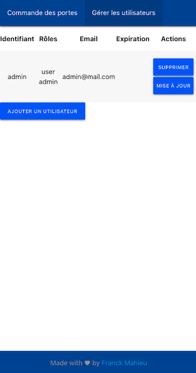

# Description

RPI Parking Doors is a project developed to open the door/s of a car park (collective or private), by activating relay
via a web application.

The project also includes a user management page, with the possibility to add (with expiration, or not), delete a user,
and modify his password

The operation is simple, when a user presses the "open door" button, a relay is activated for 10 seconds, which
simulates a press on your gate emitter, and therefore opens it.

A token is generate for each user at his creation, and set automaticaly in url (call `guid` in query param) to stay
undefinitly connected
(to not sign in everytime we need to open a door) , it's not highly secure but sufficient and user friendly for my use
case. The next step will be to implement Oauth.

# How it works

Connect you raspberry and your relays board like
describe [here](https://myhydropi.com/connecting-a-relay-board-to-a-raspberry-pi).

The relay must be connected to a raspberry pi, by default on pins 20 and 21.

If you only have one gate, you can block the button on the transmitter of your gate, and simply replace the battery with
a 5v power supply (which you would have fixed in place of the battery), which will power the transmitter only when the
relay is in the closed position. If not, the relay will be in the open position the rest of the time, so your
transmitter will no longer be powered.

If you have two gates, you can directly solder two wires on each side of each push button of your transmitter. The push
button is just a switch, we can reproduce it by connecting a relay on both sides of the push button
(by soldering it directly to the transmitter).

# Demo

## rpi-parking-doors mobile view

|              Open doors page               |            Users management page             |
| :----------------------------------------: | :------------------------------------------: |
|  |  |

# How to use

## Generate application

- Clone this repository on your desktop
- Edit the `.env` files to customize your configuration (relays, port, label, title) if needed
- Launch this commands to install dependencies and build the application :

```
npm install && npm run build
```

Now, you have in `packages/backend/dist` folder the frontend and backend optimized generates files.

## Install and launch application on Raspberry

- On the Raspberry, install NodeJS 12 or higher
- Copy generate `dist` folder on your Raspberry
- In Raspberry terminal, in `dist` folder, launch this command to install only production dependencies :

```
npm install --only=production
```

- Start the application with this command in `dist` folder

```
SQLITE_DATABASE_PATH=./data/sqlite.db node ./backend/src/main
```

So now, your application is started.

Note 1 : i advice to you to move the sqlite.sb database in ramdisk (like describe [here](#set-database-in-memory)), to
save your sd card, and just start the application with this command on `dist` folder :

```
SQLITE_DATABASE_PATH=./PATH/TO/DATABASE/sqlite.db node ./backend/src/main
```

Note 2 : Good to know, the frontend files are served by the backend application

# Configurations (not mandatory)

Edit backend `.env` file to customize the configuration

|                 Value                 |                                                       Descriptions                                                       |
| :-----------------------------------: | :----------------------------------------------------------------------------------------------------------------------: |
|               PORT=8888               |                                          Port used by the backend in production                                          |
|              STATE_ON=0               |                                       Configure the default opened state for relay                                       |
|              STATE_OFF=1              |                                       Configure the default closes state for relay                                       |
|             RELAYS=20,21              |                                       Configure the relays pin plugged on the rpi                                        |
| SQLITE_DATABASE_PATH=./data/sqlite.db | Configure the path to the sqlite database, if an SQLITE_DATABASE_PATH env var is specified, this config will be override |

Edit front `.env` file to customize the configuration

|              Value               |                              Descriptions                               |
| :------------------------------: | :---------------------------------------------------------------------: |
| Titles and labels configurations | Usefull to change language, or customize label, description in frontend |

# How is made

This project uses [React](https://reactjs.org/) for the frontend and NodeJs with the [Nestjs](https://nestjs.com/)
framework for the backend. The backend and frontend are in the same repository.
[Lerna](https://github.com/lerna/lerna) is used to simplify project scripting. It uses
a [Sqlite](https://www.sqlite.org/index.html) database only to store and query the users of the application.

The project is fully covered by 100% unit testing and also by integration testing for the backend and frontend.

The frontend integration tests were developed with [Cypress](https://www.cypress.io/) and the visual testing with
[cypress-plugin-snapshots](https://github.com/meinaart/cypress-plugin-snapshots) plugin.

## For developer

### Launch Web Application

You can launch the web application localy in watch mode, simply by running in the root folder this commands

- Just the first time to download dependencies :

```
npm run install
```

- And launch the backend and frontend in dev mode:

```
npm run start:dev
```

Note, The [onoff](https://github.com/fivdi/onoff) library is mocked on your local computer to allow local launching.

### Swagger

You can launch backend application in dev mode, et simply go to http://localhost:8888/swagger/ to see API documentation


## Tests

You can launch tests of frontend and backend with this commands at the root folder :

```
# unit tests with coverage
$ npm run test:cov

# e2e tests
$ npm run test:e2e
```

# Advices

## HTTPS

I advise you to expose the application via HTTPS, I personally used nginx with a let's encrypt certificate, as described
here [certbot](https://certbot.eff.org/lets-encrypt/debianbuster-nginx).

My IP is not static, so I use the free [no-ip](https://www.noip.com/) service (which needs to be renewed every month, to
prove that the domain is still in use), which I have configured with my router to give me a static domain for my not
static ip.

## Set database in memory

I advise you to place sqlite database `backend/data/sqlite.db` in memory and regularly save it in the file system, in
order to preserve the longevity of the SD card. To do it, we can simply launch one script at Raspberry startup to copy
data base in ramdisk, then launch every day a second script to copy the database on ramdisk, on filesystem.

## SystemD

I advise to you to create a service for your application and launch it
with [systemctl](https://wiki.archlinux.org/index.php/systemd) to automaticly restart it if an error occured

# Possible improvements

- Implement an auth with Oauth2
- Improve design

# Support

- I'm Franck Mahieu, available on [Twitter](https://twitter.com/Franck_Mahieu) or
  by [email](mailto:franck.mahieu59@gmail.com)
